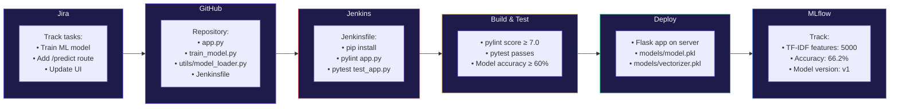

# AI Resume Screening — CI/CD & MLOps Pipeline

## End-to-End Pipeline

```mermaid
flowchart LR
    A["📋 Jira\nTask Management"]
    B["🐙 GitHub / Bitbucket\nVersion Control"]
    C["⚙️ Jenkins\nCI/CD Server"]
    D["🔨 Build & Test\nAutomated Pipeline"]
    E["🚀 Deployment\nProduction Server"]
    F["📊 MLflow Tracking\nModel Registry"]

    A -->|"Create ticket &\nassign sprint"| B
    B -->|"Push / PR\ntriggers webhook"| C
    C -->|"Run pipeline\nstages"| D
    D -->|"All tests pass →\ndeploy artifact"| E
    E -->|"Log metrics &\nregister model"| F

    style A fill:#1e1b4b,stroke:#6366f1,color:#f1f5f9,stroke-width:2px
    style B fill:#1e1b4b,stroke:#8b5cf6,color:#f1f5f9,stroke-width:2px
    style C fill:#1e1b4b,stroke:#ef4444,color:#f1f5f9,stroke-width:2px
    style D fill:#1e1b4b,stroke:#f59e0b,color:#f1f5f9,stroke-width:2px
    style E fill:#1e1b4b,stroke:#10b981,color:#f1f5f9,stroke-width:2px
    style F fill:#1e1b4b,stroke:#3b82f6,color:#f1f5f9,stroke-width:2px
```

---

## Detailed Pipeline Breakdown

```mermaid
flowchart TD
    subgraph JIRA["📋 Jira — Task Management"]
        J1["Create User Story / Bug"]
        J2["Assign to Sprint"]
        J3["Move to In Progress"]
    end

    subgraph GIT["🐙 GitHub / Bitbucket — Version Control"]
        G1["Create Feature Branch"]
        G2["Commit Code Changes"]
        G3["Open Pull Request"]
        G4["Code Review & Approve"]
        G5["Merge to Main Branch"]
    end

    subgraph JENKINS["⚙️ Jenkins — CI/CD Server"]
        K1["Webhook Triggers Build"]
        K2["Pull Latest Code"]
        K3["Install Dependencies\npip install -r requirements.txt"]
    end

    subgraph BUILD["🔨 Build & Test"]
        B1["Lint Code (pylint)"]
        B2["Run Unit Tests (pytest)"]
        B3["Train Model\npython train_model.py"]
        B4["Validate Model Accuracy"]
        B5{"All Checks\nPassed?"}
    end

    subgraph DEPLOY["🚀 Deployment"]
        D1["Build Docker Image"]
        D2["Push to Container Registry"]
        D3["Deploy to Staging"]
        D4["Smoke Tests"]
        D5["Deploy to Production"]
    end

    subgraph MLFLOW["📊 MLflow Tracking"]
        M1["Log Parameters\n(max_features, max_iter)"]
        M2["Log Metrics\n(accuracy, f1-score)"]
        M3["Log Artifacts\n(model.pkl, vectorizer.pkl)"]
        M4["Register Model Version"]
        M5["Compare with Previous Runs"]
    end

    J1 --> J2 --> J3 --> G1
    G1 --> G2 --> G3 --> G4 --> G5
    G5 --> K1 --> K2 --> K3
    K3 --> B1 --> B2 --> B3 --> B4 --> B5
    B5 -- "Yes ✅" --> D1
    B5 -- "No ❌" --> FAIL["🔴 Notify Team\nFix & Re-push"]
    FAIL --> G2
    D1 --> D2 --> D3 --> D4 --> D5
    D5 --> M1 --> M2 --> M3 --> M4 --> M5

    style JIRA fill:#0f172a,stroke:#6366f1,color:#f1f5f9
    style GIT fill:#0f172a,stroke:#8b5cf6,color:#f1f5f9
    style JENKINS fill:#0f172a,stroke:#ef4444,color:#f1f5f9
    style BUILD fill:#0f172a,stroke:#f59e0b,color:#f1f5f9
    style DEPLOY fill:#0f172a,stroke:#10b981,color:#f1f5f9
    style MLFLOW fill:#0f172a,stroke:#3b82f6,color:#f1f5f9
    style FAIL fill:#7f1d1d,stroke:#ef4444,color:#fca5a5
```

---

## Pipeline Mapped to Project Files

```mermaid
flowchart LR
    subgraph STAGE1["Jira"]
        S1["Track tasks:\n• Train ML model\n• Add /predict route\n• Update UI"]
    end

    subgraph STAGE2["GitHub"]
        S2["Repository:\n• app.py\n• train_model.py\n• utils/model_loader.py\n• Jenkinsfile"]
    end

    subgraph STAGE3["Jenkins"]
        S3["Jenkinsfile:\n• pip install\n• pylint app.py\n• pytest test_app.py"]
    end

    subgraph STAGE4["Build & Test"]
        S4["• pylint score ≥ 7.0\n• pytest passes\n• Model accuracy ≥ 60%"]
    end

    subgraph STAGE5["Deploy"]
        S5["• Flask app on server\n• models/model.pkl\n• models/vectorizer.pkl"]
    end

    subgraph STAGE6["MLflow"]
        S6["Track:\n• TF-IDF features: 5000\n• Accuracy: 66.2%\n• Model version: v1"]
    end

    STAGE1 --> STAGE2 --> STAGE3 --> STAGE4 --> STAGE5 --> STAGE6

    style STAGE1 fill:#1e1b4b,stroke:#6366f1,color:#f1f5f9
    style STAGE2 fill:#1e1b4b,stroke:#8b5cf6,color:#f1f5f9
    style STAGE3 fill:#1e1b4b,stroke:#ef4444,color:#f1f5f9
    style STAGE4 fill:#1e1b4b,stroke:#f59e0b,color:#f1f5f9
    style STAGE5 fill:#1e1b4b,stroke:#10b981,color:#f1f5f9
    style STAGE6 fill:#1e1b4b,stroke:#3b82f6,color:#f1f5f9
```
